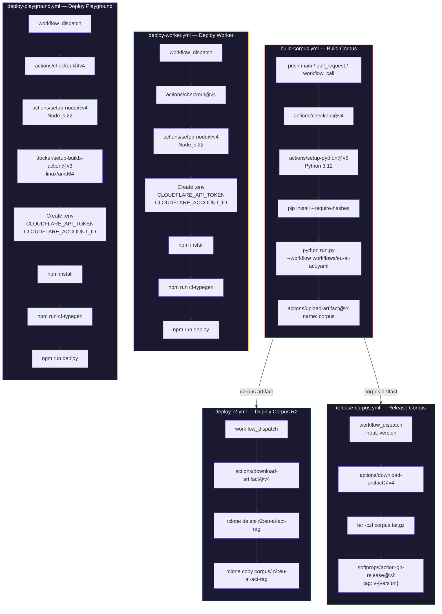

# EU AI Act RAG

**[Live Demo](https://eu-ai-act-rag-playground.aras.tc/)**

## Pipeline


## Quick Start

```bash
pip install -r workflow-engine/requirements.txt
python run.py --workflow workflows/eu-ai-act.yaml
```

## Output

```
dist/eu-ai-act-{timestamp}/
├── validation-report.json
└── corpus/
    ├── articles/*.md          (113)
    ├── recitals/*.md          (180)
    └── annexes/*.md           (13)
```

## Validation

The pipeline runs a deterministic validation step between parse and convert (Phase 3.5). It operates in **advisory mode** — logs warnings and generates a report but never blocks the pipeline.

Two independent text extraction paths are compared for each item:

| Path                   | Method                          | Scope                       |
|------------------------|---------------------------------|-----------------------------|
| **Source** (validator) | `etree.tostring(method="text")` | All text nodes — exhaustive |
| **Parsed** (parser)    | Selective tag traversal         | Only handled elements       |

If the parser's structural traversal misses a sub-tree, the exhaustive source path catches it through the **coverage ratio** (`parsed_len / source_len`).

**Checks:**

| Check                | Type                                   | Threshold    |
|----------------------|----------------------------------------|--------------|
| Count validation     | articles=113, recitals=180, annexes=13 | exact match  |
| Empty content        | items with no body text                | any = fail   |
| Sequential numbering | gaps in article numbers                | any = warn   |
| Structural integrity | missing title or chapter context       | any = warn   |
| Coverage ratio       | `parsed_len / source_len` per item     | < 0.8 = warn |

Configuration in `workflows/eu-ai-act.yaml` under the `validation:` section.

## RAG Configuration

| Parameter        | Value                                      |
|------------------|--------------------------------------------|
| Embedding Model  | `@cf/qwen/qwen3-embedding-0.6b`            |
| Generation Model | `@cf/meta/llama-3.3-70b-instruct-fp8-fast` |
| Chunk Size       | 384 tokens                                 |
| Chunk Overlap    | 20%                                        |
| Vector Store     | Cloudflare Vectorize (1024 dimensions)     |
| Object Storage   | Cloudflare R2                              |

### Cloudflare Documentation

- [AI Search](https://developers.cloudflare.com/ai-search/)
- [Vectorize](https://developers.cloudflare.com/vectorize/)
- [R2 Object Storage](https://developers.cloudflare.com/r2/)

## Project Structure

```
eu-ai-act-rag/
├── run.py                          # Entry point
├── workflows/
│   └── eu-ai-act.yaml             # Workflow definition
├── workflow-engine/
│   ├── requirements.in
│   ├── requirements.txt
│   └── src/
│       ├── config.py
│       ├── converter.py
│       ├── fetcher.py
│       ├── logger.py
│       ├── parser.py
│       ├── pipeline.py
│       ├── result.py
│       ├── validator.py
│       └── sparql/
│           ├── client.py
│           ├── processor.py
│           └── queries.py
├── worker/                         # Cloudflare Worker (AutoRAG API)
│   ├── wrangler.jsonc
│   ├── package.json
│   └── src/
│       ├── index.ts
│       ├── config.ts
│       ├── types.ts
│       ├── translations.ts
│       ├── ai/
│       │   ├── manager.ts
│       │   └── prompts/
│       │       └── system-prompt.md
│       ├── middleware/
│       │   └── ratelimit.ts
│       ├── validation/
│       │   ├── request.ts
│       │   └── schema.ts
│       └── utils/
│           ├── errors.ts
│           └── logging.ts
├── playground/                     # Streamlit on Cloudflare Containers
│   ├── wrangler.jsonc
│   ├── package.json
│   ├── Dockerfile
│   ├── start.sh
│   ├── src/
│   │   └── index.ts               # Hono reverse proxy
│   └── app/
│       ├── app.py
│       ├── translations.py
│       ├── export_utils.py
│       ├── locales/
│       │   ├── en.json
│       │   └── tr.json
│       └── .streamlit/
│           └── config.toml
└── dist/                           # Output (gitignored)
```

## CI/CD



| Workflow                 | Trigger                    | Runner        | Output                 |
|--------------------------|----------------------------|---------------|------------------------|
| `build-corpus.yml`       | push, pull_request, manual | ubuntu-latest | corpus artifact        |
| `deploy-r2.yml`          | manual                     | self-hosted   | R2 bucket upload       |
| `deploy-worker.yml`      | manual                     | self-hosted   | Cloudflare Worker      |
| `deploy-playground.yml`  | manual                     | self-hosted   | Cloudflare Container   |
| `release-corpus.yml`     | manual (version input)     | ubuntu-latest | GitHub Release v-x.y.z |

## License

MIT License — Copyright (C) 2026 Riza Emre ARAS

See [LICENSE](LICENSE) and [THIRD_PARTY_LICENSES](THIRD_PARTY_LICENSES) for details.
