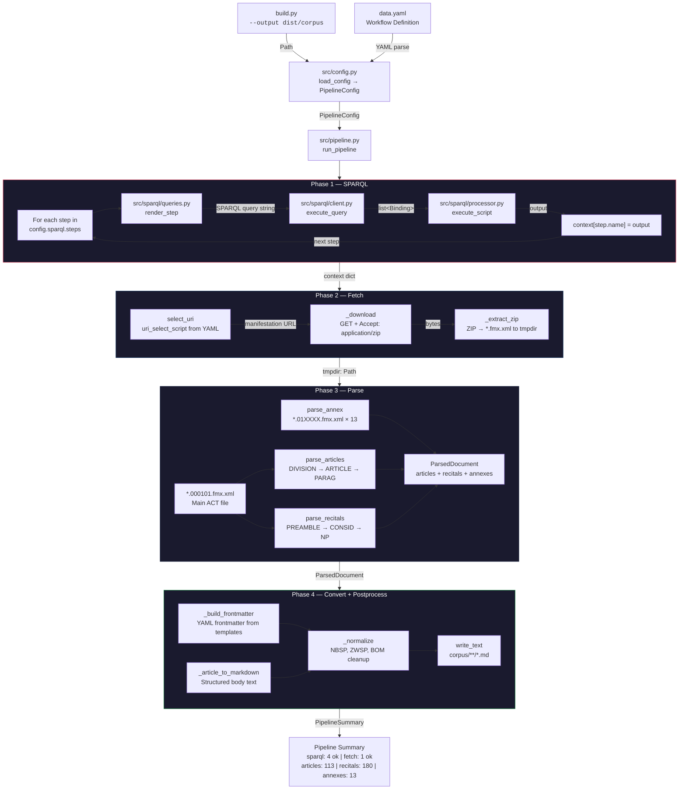

# EU AI Act RAG

## Pipeline



## Hızlı Başlangıç

```bash
pip install -r workflow-engine/requirements.txt
python build.py
```

```bash
python build.py --output path/to/output
```

## Çıktı

| Bölüm    | Adet | Dizin                         |
|----------|------|-------------------------------|
| Maddeler | 113  | `dist/corpus/articles/*.md`   |
| Gerekçe  | 180  | `dist/corpus/recitals/*.md`   |
| Ekler    | 13   | `dist/corpus/annexes/*.md`    |


## Proje Yapısı


## Project Structure

```
eu-ai-act-rag/
├── build.py                    
├── data.yaml                   
├── workflow-engine/
│   ├── requirements.in
│   ├── requirements.txt        
│   └── src/
│       ├── config.py           
│       ├── converter.py        
│       ├── fetcher.py          
│       ├── logger.py           
│       ├── parser.py           
│       ├── pipeline.py         
│       ├── result.py           
│       └── sparql/
│           ├── client.py       
│           ├── processor.py    
│           └── queries.py      
└── dist/corpus/                
```

## Lisans

MIT Lisansı — Telif Hakkı (C) 2026 Rıza Emre ARAS

Ayrıntılar için [LICENSE](LICENSE) ve [THIRD_PARTY_LICENSES](THIRD_PARTY_LICENSES) dosyalarına bakınız.