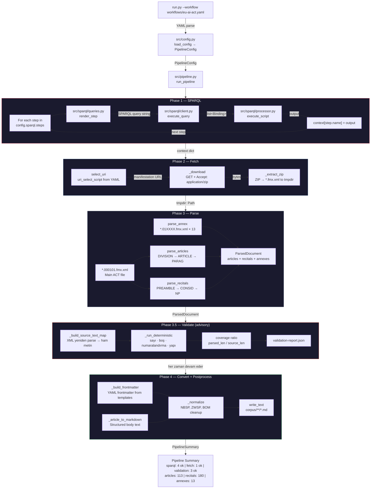

# EU AI Act RAG

**[Canlı Demo](https://eu-ai-act-rag-playground.aras.tc/)**

## Pipeline



## Hızlı Başlangıç

```bash
pip install -r workflow-engine/requirements.txt
python run.py --workflow workflows/eu-ai-act.yaml
```

## Çıktı

```
dist/eu-ai-act-{zaman_damgası}/
├── validation-report.json
└── corpus/
    ├── articles/*.md          (113)
    ├── recitals/*.md          (180)
    └── annexes/*.md           (13)
```

## Doğrulama (Validation)

Pipeline, parse ve convert aşamaları arasında deterministik bir doğrulama adımı (Phase 3.5) çalıştırır. **Advisory modda** çalışır — uyarı loglar ve rapor üretir ancak pipeline'ı asla durdurmaz.

Her öğe için iki bağımsız metin çıkarma yolu karşılaştırılır:

| Yol                        | Yöntem                          | Kapsam                         |
|----------------------------|---------------------------------|--------------------------------|
| **Kaynak** (validator)     | `etree.tostring(method="text")` | Tüm metin düğümleri — kapsamlı |
| **Ayrıştırılmış** (parser) | Seçici tag traversal            | Yalnızca tanınan elementler    |

Parser'ın yapısal taraması bir alt ağacı atlarsa, kapsamlı kaynak yolu bunu **kapsama oranı** (`parsed_len / source_len`) aracılığıyla yakalar.

**Kontroller:**

| Kontrol               | Tür                                  | Eşik                 |
|-----------------------|--------------------------------------|----------------------|
| Sayı doğrulama        | madde=113, gerekçe=180, ek=13        | tam eşleşme          |
| Boş içerik            | gövdesi olmayan öğeler               | herhangi biri = fail |
| Sıralı numaralandırma | madde numaralarında boşluk           | herhangi biri = warn |
| Yapısal bütünlük      | eksik başlık veya bölüm bağlamı      | herhangi biri = warn |
| Kapsama oranı         | öğe başına `parsed_len / source_len` | < 0.8 = warn         |

Yapılandırma `workflows/eu-ai-act.yaml` dosyasındaki `validation:` bölümünde bulunur.

## RAG Yapılandırması

| Parametre        | Değer                                      |
|------------------|--------------------------------------------|
| Embedding Model  | `@cf/qwen/qwen3-embedding-0.6b`            |
| Generation Model | `@cf/meta/llama-3.3-70b-instruct-fp8-fast` |
| Chunk Boyutu     | 384 token                                  |
| Chunk Örtüşme    | %20                                        |
| Vektör Deposu    | Cloudflare Vectorize (1024 boyut)          |
| Nesne Deposu     | Cloudflare R2                              |

### Cloudflare Belgeleri

- [AI Search](https://developers.cloudflare.com/ai-search/)
- [Vectorize](https://developers.cloudflare.com/vectorize/)
- [R2 Object Storage](https://developers.cloudflare.com/r2/)

## Proje Yapısı

```
eu-ai-act-rag/
├── run.py                          # Giriş noktası
├── workflows/
│   └── eu-ai-act.yaml             # Workflow tanımı
├── workflow-engine/
│   ├── requirements.in
│   ├── requirements.txt
│   └── src/
│       ├── config.py
│       ├── converter.py
│       ├── fetcher.py
│       ├── logger.py
│       ├── parser.py
│       ├── pipeline.py
│       ├── result.py
│       ├── validator.py
│       └── sparql/
│           ├── client.py
│           ├── processor.py
│           └── queries.py
├── worker/                         # Cloudflare Worker (AutoRAG API)
│   ├── wrangler.jsonc
│   ├── package.json
│   └── src/
│       ├── index.ts
│       ├── config.ts
│       ├── types.ts
│       ├── translations.ts
│       ├── ai/
│       │   ├── manager.ts
│       │   └── prompts/
│       │       └── system-prompt.md
│       ├── middleware/
│       │   └── ratelimit.ts
│       ├── validation/
│       │   ├── request.ts
│       │   └── schema.ts
│       └── utils/
│           ├── errors.ts
│           └── logging.ts
├── playground/                     # Streamlit - Cloudflare Containers
│   ├── wrangler.jsonc
│   ├── package.json
│   ├── Dockerfile
│   ├── start.sh
│   ├── src/
│   │   └── index.ts               # Hono reverse proxy
│   └── app/
│       ├── app.py
│       ├── translations.py
│       ├── export_utils.py
│       ├── locales/
│       │   ├── en.json
│       │   └── tr.json
│       └── .streamlit/
│           └── config.toml
└── dist/                           # Çıktı (gitignore)
```

## CI/CD

| Workflow                  | Tetikleyici                            | Runner        | Çıktı                  |
|---------------------------|----------------------------------------|---------------|------------------------|
| `build-corpus.yml`        | `workflows/**` push/PR, manuel         | ubuntu-latest | corpus artifact        |
| `build-gdpr-corpus.yml`   | `workflows/**` push, manuel            | ubuntu-latest | gdpr-corpus artifact   |
| `deploy-r2.yml`           | manuel                                 | self-hosted   | R2 bucket yüklemesi    |
| `deploy-worker.yml`       | `worker/**` push, manuel               | self-hosted   | Cloudflare Worker      |
| `deploy-playground.yml`   | `playground/**` push, manuel           | self-hosted   | Cloudflare Container   |
| `release-corpus.yml`      | manuel (version input)                 | ubuntu-latest | GitHub Release v-x.y.z |

## Lisans

MIT Lisansı — Telif Hakkı (C) 2026 Rıza Emre ARAS, Artek İnovasyon Arge Sanayi ve Ticaret Ltd. Şti.

Ayrıntılar için [LICENSE](LICENSE) ve [THIRD_PARTY_LICENSES](THIRD_PARTY_LICENSES) dosyalarına bakınız.
