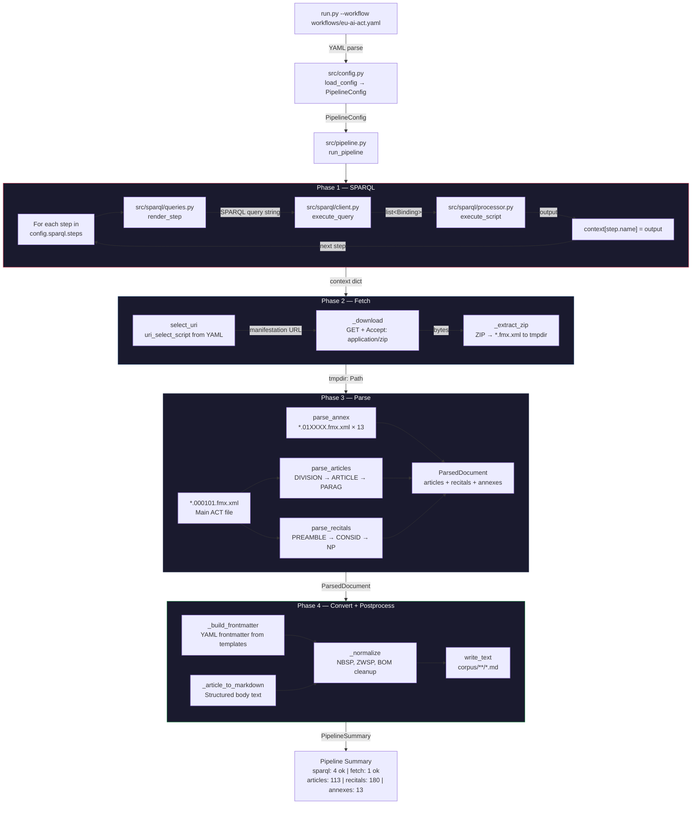
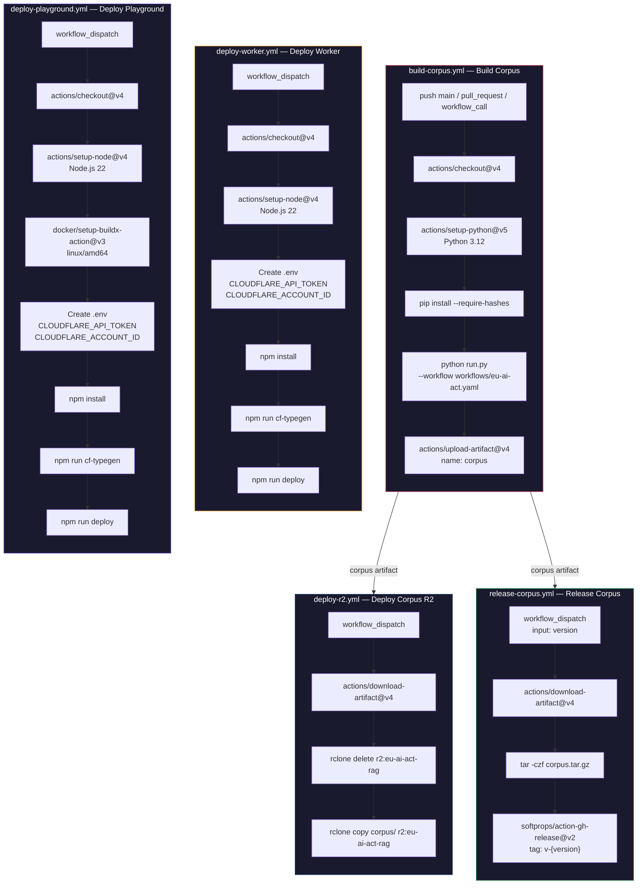

# EU AI Act RAG

## Pipeline



## Hızlı Başlangıç

```bash
pip install -r workflow-engine/requirements.txt
python run.py --workflow workflows/eu-ai-act.yaml
```

## Çıktı

| Bölüm    | Adet | Dizin                  |
|----------|------|------------------------|
| Maddeler | 113  | `corpus/articles/*.md` |
| Gerekçe  | 180  | `corpus/recitals/*.md` |
| Ekler    | 13   | `corpus/annexes/*.md`  |

## RAG Yapılandırması

| Parametre        | Değer                                      |
|------------------|--------------------------------------------|
| Embedding Model  | `@cf/qwen/qwen3-embedding-0.6b`            |
| Generation Model | `@cf/meta/llama-3.3-70b-instruct-fp8-fast` |
| Chunk Boyutu     | 512 token                                  |
| Chunk Örtüşme    | %10                                        |
| Vektör Deposu    | Cloudflare Vectorize (1024 boyut)          |
| Nesne Deposu     | Cloudflare R2                              |

### Cloudflare Belgeleri

- [AI Search](https://developers.cloudflare.com/ai-search/)
- [Vectorize](https://developers.cloudflare.com/vectorize/)
- [R2 Object Storage](https://developers.cloudflare.com/r2/)

## Proje Yapısı

```
eu-ai-act-rag/
├── run.py                          # Giriş noktası
├── workflows/
│   └── eu-ai-act.yaml             # Workflow tanımı
├── workflow-engine/
│   ├── requirements.in
│   ├── requirements.txt
│   └── src/
│       ├── config.py
│       ├── converter.py
│       ├── fetcher.py
│       ├── logger.py
│       ├── parser.py
│       ├── pipeline.py
│       ├── result.py
│       └── sparql/
│           ├── client.py
│           ├── processor.py
│           └── queries.py
├── worker/                         # Cloudflare Worker (AutoRAG API)
│   ├── wrangler.jsonc
│   ├── package.json
│   └── src/
│       ├── index.ts
│       ├── config.ts
│       ├── types.ts
│       ├── translations.ts
│       ├── ai/
│       │   ├── manager.ts
│       │   └── prompts/
│       │       └── system-prompt.md
│       ├── middleware/
│       │   └── ratelimit.ts
│       ├── validation/
│       │   ├── request.ts
│       │   └── schema.ts
│       └── utils/
│           ├── errors.ts
│           └── logging.ts
├── playground/                     # Streamlit - Cloudflare Containers
│   ├── wrangler.jsonc
│   ├── package.json
│   ├── Dockerfile
│   ├── start.sh
│   ├── src/
│   │   └── index.ts               # Hono reverse proxy
│   └── app/
│       ├── app.py
│       ├── translations.py
│       ├── export_utils.py
│       ├── locales/
│       │   ├── en.json
│       │   └── tr.json
│       └── .streamlit/
│           └── config.toml
└── dist/                           # Çıktı (gitignore)
```

## CI/CD



| Workflow                 | Tetikleyici                | Runner        | Çıktı                  |
|--------------------------|----------------------------|---------------|------------------------|
| `build-corpus.yml`       | push, pull_request, manual | ubuntu-latest | corpus artifact        |
| `deploy-r2.yml`          | manual                     | self-hosted   | R2 bucket yüklemesi    |
| `deploy-worker.yml`      | manual                     | self-hosted   | Cloudflare Worker      |
| `deploy-playground.yml`  | manual                     | self-hosted   | Cloudflare Container   |
| `release-corpus.yml`     | manual (version input)     | ubuntu-latest | GitHub Release v-x.y.z |

## Lisans

MIT Lisansı — Telif Hakkı (C) 2026 Rıza Emre ARAS

Ayrıntılar için [LICENSE](LICENSE) ve [THIRD_PARTY_LICENSES](THIRD_PARTY_LICENSES) dosyalarına bakınız.
